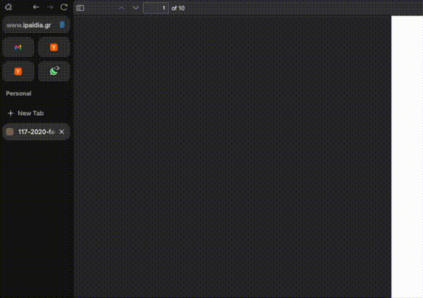

# Later

**Schedule any webpage to open at a specific time.**



Found an interesting article but don't have time now? Want to auto-join meetings without watching the clock? Later lets you schedule URLs to open exactly when you need them.

## How it works

1. Browse to any page
2. Press `Option+L` (or click the extension icon)
3. Pick a time — or use quick presets: *In 1hr*, *Tonight*, *Tomorrow*
4. The page opens automatically at that time

That's it. No accounts, no cloud, everything runs locally.

## Features

- **Quick presets** — One click to schedule for common times
- **Reschedule** — Change your mind? Click edit and pick a new time
- **Right-click any link** — Schedule without opening it first
- **Keyboard shortcut** — `Option+L` (Mac) / `Alt+Shift+L` (Windows/Linux)
- **Works offline** — Everything runs on your machine

## Installation

### Prerequisites

- macOS (Linux support coming)
- [uv](https://docs.astral.sh/uv/) — fast Python package manager

```bash
# Install uv if you don't have it
curl -LsSf https://astral.sh/uv/install.sh | sh
```

### 1. Clone and install daemon

```bash
git clone https://github.com/adagradschool/later.git
cd later/daemon
uv sync
```

### 2. Start the daemon

**Option A: Run manually**
```bash
cd daemon
uv run python -m later.main
```

**Option B: Auto-start on login (recommended)**
```bash
./launchd/install.sh
```

### 3. Install browser extension

**Firefox / Zen:**
1. Go to `about:debugging#/runtime/this-firefox`
2. Click "Load Temporary Add-on..."
3. Select `extension/dist/firefox/manifest.json`

**Chrome / Arc / Edge:**
1. Go to `chrome://extensions`
2. Enable "Developer mode"
3. Click "Load unpacked"
4. Select `extension/dist/chrome/`

### 4. Test it

1. Navigate to any webpage
2. Press `Option+L`
3. Click "In 1hr" or pick a custom time
4. Wait for it to open!

## Usage

### Keyboard shortcut
- `Option+L` (Mac) or `Alt+Shift+L` (Windows/Linux) opens the popup

### Quick presets
- **In 1hr** — Opens 1 hour from now
- **Tonight** — Opens at 9 PM (or tomorrow if past 9 PM)
- **Tomorrow** — Opens at 9 AM tomorrow

### Right-click menu
Right-click any link → "Schedule for Later (1hr)"

### Reschedule
In the popup, hover over a scheduled item and click ✎ to reschedule

### Delete
Hover over a scheduled item and click × to remove it

## Architecture

```
┌─────────────────────┐     localhost:7432     ┌──────────────────┐
│  Browser Extension  │ ◄──────────────────────► │     Daemon       │
│  - Popup UI         │                         │  - FastAPI       │
│  - Keyboard shortcut│                         │  - SQLite        │
│  - Context menu     │                         │  - Scheduler     │
└─────────────────────┘                         └──────────────────┘
```

- **Extension** — Captures URLs, provides scheduling UI
- **Daemon** — Stores schedules in SQLite, opens URLs at the right time
- **Communication** — REST API over localhost

## Development

```bash
# Run daemon in dev mode
cd daemon
uv run python -m later.main

# Rebuild extension after changes
cd extension
./build.sh
```

## Uninstall

```bash
# Stop and remove launchd service
./launchd/uninstall.sh

# Remove the extension from your browser manually
```

## License

MIT
